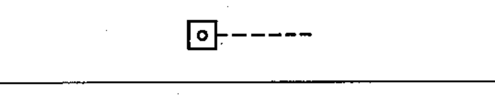

# 02-14-02 — Control by number of events / by a counter

Per-symbol crop from Publication No.617-2.pdf, printed p.27 ([full page](../assets/60617-2/p29.png)).

**Standard:** [[60617-2]] · **Chapter III — Other symbols having general application** · **Section:** [[60617-2-14-non-electrical-control]]

## Description
Control by number of events; control by a counter.

## Names
- **EN:** Control by number of events / by a counter
- **FR:** Commande par un nombre d'événements / par comptage

