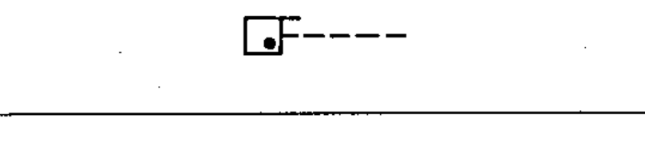

# 02-14-04 — Control by gas flow — example

Per-symbol crop from Publication No.617-2.pdf, printed p.27 ([full page](../assets/60617-2/p29.png)).

**Standard:** [[60617-2]] · **Chapter III — Other symbols having general application** · **Section:** [[60617-2-14-non-electrical-control]]

## Description
Worked example: control by gas flow.

## Names
- **EN:** Control by gas flow — example
- **FR:** Commande par le débit d'un gaz — exemple

## Related
- [[02-14-03]]
