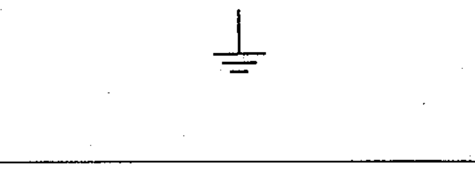

# 02-15-01 — Earth (ground), general symbol

Per-symbol crop from Publication No.617-2.pdf, printed p.28 ([full page](../assets/60617-2/p30.png)).

**Standard:** [[60617-2]] · **Chapter III — Other symbols having general application** · **Section:** [[60617-2-15-earth-frame]]

## Description
Earth (ground), general symbol.

## Names
- **EN:** Earth (ground), general symbol
- **FR:** Terre, symbole général

## Notes
- Supplementary information may be given to define the status or purpose of the earth if this is not readily apparent.

## Related
- [[02-15-02]]
- [[02-15-03]]
