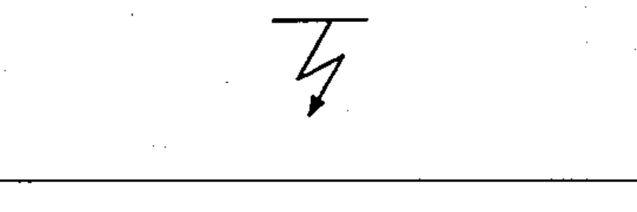

# 02-17-02 — Flashover / break-through

Per-symbol crop from Publication No.617-2.pdf, printed p.30 ([full page](../assets/60617-2/p32.png)).

**Standard:** [[60617-2]] · **Chapter III — Other symbols having general application** · **Section:** [[60617-2-17-miscellaneous]]

## Description
Flashover; break-through (insulation failure by flashover, puncture, etc.).

## Names
- **EN:** Flashover / break-through
- **FR:** Défaut d'isolement (contournement, perforation, claquage)

