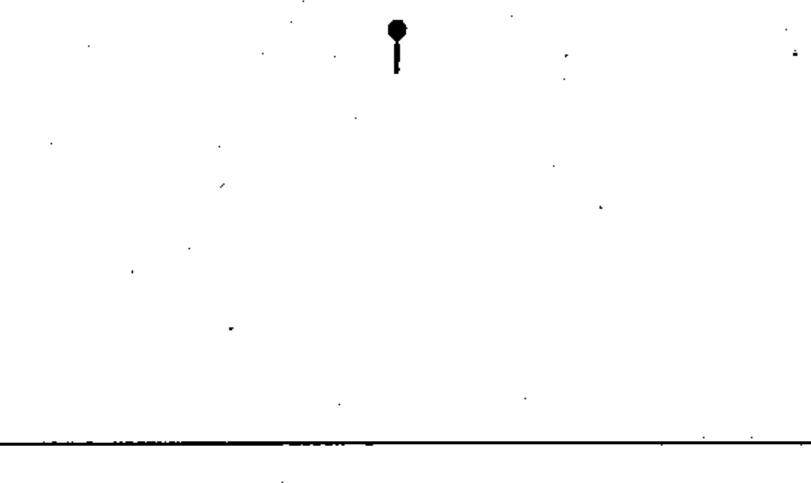

# 02-17-05 — Test point indicator

Per-symbol crop from Publication No.617-2.pdf, printed p.30 ([full page](../assets/60617-2/p32.png)).

**Standard:** [[60617-2]] · **Chapter III — Other symbols having general application** · **Section:** [[60617-2-17-miscellaneous]]

## Description
Test point indicator.

## Names
- **EN:** Test point indicator
- **FR:** Indicateur de point de contrôle

