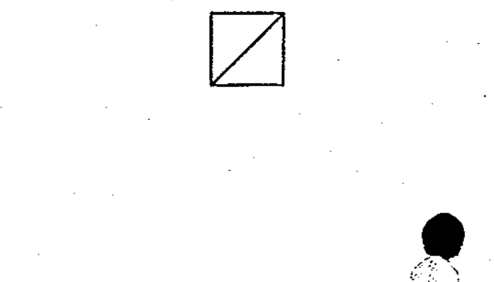

# 02-17-06 — Changer / converter, general symbol

Per-symbol crop from Publication No.617-2.pdf, printed p.30 ([full page](../assets/60617-2/p32.png)).

**Standard:** [[60617-2]] · **Chapter III — Other symbols having general application** · **Section:** [[60617-2-17-miscellaneous]]

## Description
Changer; converter, general symbol.

## Names
- **EN:** Changer / converter, general symbol
- **FR:** Convertisseur, symbole général

## Notes
- If the direction of change is not obvious, it may be indicated by an arrowhead on the outline of the symbol.
- A symbol/legend for input or output quantity may be inserted in each half; see IEC 617-6 and 617-10.
- The diagonal line is used as a solidus to show a converting function; see IEC 617-12 and 617-13.

## Related
- references **IEC 617-6**
- references **IEC 617-10**
- references **IEC 617-12**
- references **IEC 617-13**
