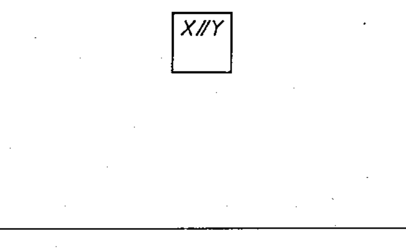

# 02-17-07 — Galvanic separator

Per-symbol crop from Publication No.617-2.pdf, printed p.31 ([full page](../assets/60617-2/p33.png)).

**Standard:** [[60617-2]] · **Chapter III — Other symbols having general application** · **Section:** [[60617-2-17-miscellaneous]]

## Description
Galvanic separator.

## Names
- **EN:** Galvanic separator
- **FR:** Séparateur galvanique

## Notes
- If necessary, indication of the way of separation may be given below the qualifying symbol, for example X≠Y (galvanic separation by opto-coupler).

