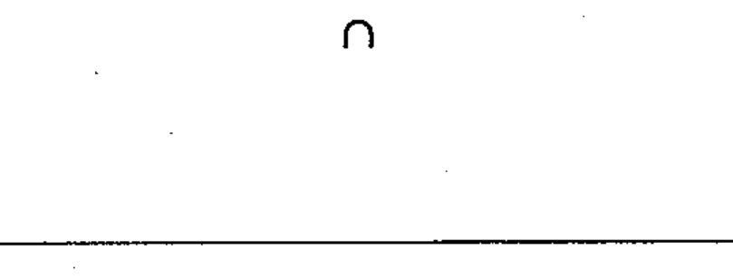

# 02-17-08 — Identifier of analogue signals

Per-symbol crop from Publication No.617-2.pdf, printed p.31 ([full page](../assets/60617-2/p33.png)).

**Standard:** [[60617-2]] · **Chapter III — Other symbols having general application** · **Section:** [[60617-2-17-miscellaneous]]

## Description
Identifier of analogue signals.

## Names
- **EN:** Identifier of analogue signals
- **FR:** Symbole d'identification des signaux analogiques

## Notes
- Used only when it is necessary to distinguish between analogue and digital signals.

## Related
- [[02-17-09]]
