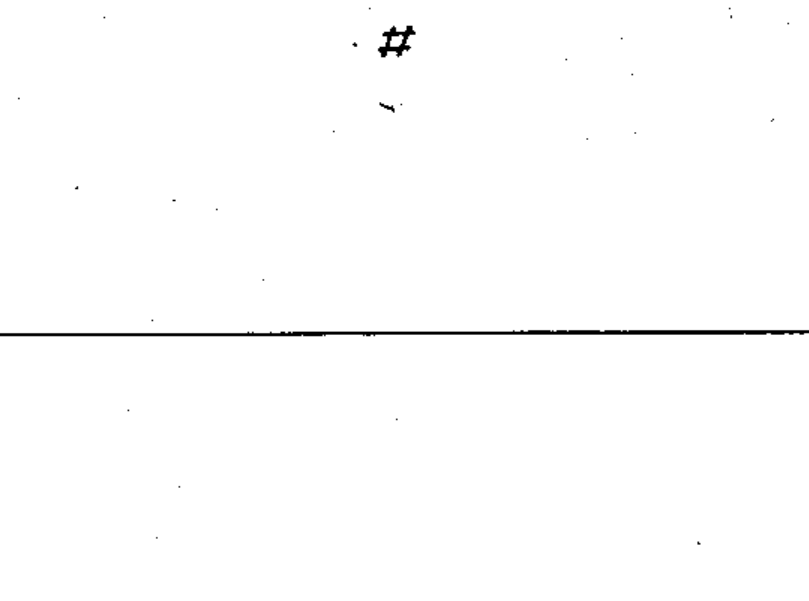

# 02-17-09 — Identifier of digital signals

Per-symbol crop from Publication No.617-2.pdf, printed p.31 ([full page](../assets/60617-2/p33.png)).

**Standard:** [[60617-2]] · **Chapter III — Other symbols having general application** · **Section:** [[60617-2-17-miscellaneous]]

## Description
Identifier of digital signals.

## Names
- **EN:** Identifier of digital signals
- **FR:** Symbole d'identification des signaux numériques

## Notes
- The note with symbol 02-17-08 applies. A number (n) of bits may be denoted as n·#.

## Related
- [[02-17-08]]
