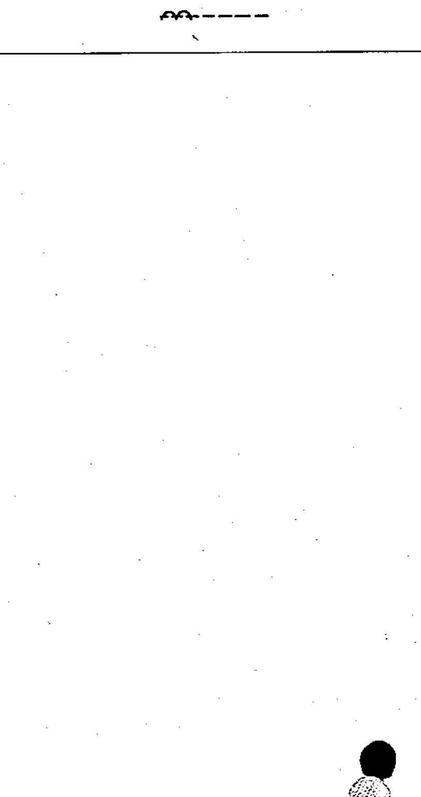

# 02-A1-01 — Operated by electromagnetic actuator (older symbol)

Per-symbol crop from Publication No.617-2.pdf, printed p.32 ([full page](../assets/60617-2/p34.png)).

**Standard:** [[60617-2]] · **Chapter Appendix A** · **Section:** [[60617-2-A1-older-symbols]]

## Description
Older symbol: operated by electromagnetic actuator. Required for a change-over period only.

## Names
- **EN:** Operated by electromagnetic actuator (older symbol)
- **FR:** Commande électromagnétique (ancien symbole)

## Notes
- Should be superseded as soon as practicable by symbol 02-13-23.

## Related
- superseded by [[02-13-23]]
