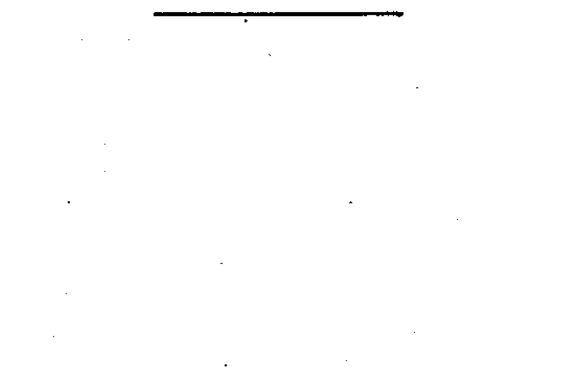

# 03-01-01 — Conductor

Per-symbol crop from Publication No.617-3.pdf, printed p.4 ([full page](../assets/60617-3/p03.png)).

**Standard:** [[60617-3]] · **Section:** [[60617-3-1-conductors]]

## Description
A single conductor. The same symbol also denotes a group of conductors, a line, a cable, a circuit, or a transmission path (for example, for microwaves).

## Names
- **EN:** Conductor / Group of conductors / Line / Cable / Circuit / Transmission path
- **FR:** Conducteur

## Notes
- Single-line representation of conductors: when a single line represents a group of conductors, their number may be indicated either by adding small oblique strokes or one oblique stroke completed by a figure.

## Related
- [[03-01-02]]
- [[03-01-03]]
- uses [[single-line-representation]]
