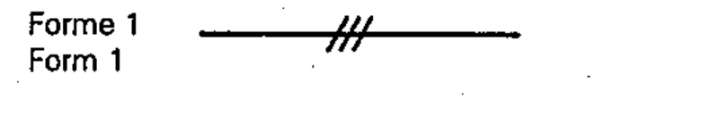

# 03-01-02 — Three conductors (Form 1)

Per-symbol crop from Publication No.617-3.pdf, printed p.4 ([full page](../assets/60617-3/p03.png)).

**Standard:** [[60617-3]] · **Section:** [[60617-3-1-conductors]] · **Form 1**

## Description
Three conductors, indicated by adding three small oblique strokes to the single conductor line.

## Names
- **EN:** Three conductors (Form 1)
- **FR:** Trois conducteurs (Forme 1)

## Related
- [[03-01-03]] — alternative form
- [[03-01-01]]
- uses [[single-line-representation]]
