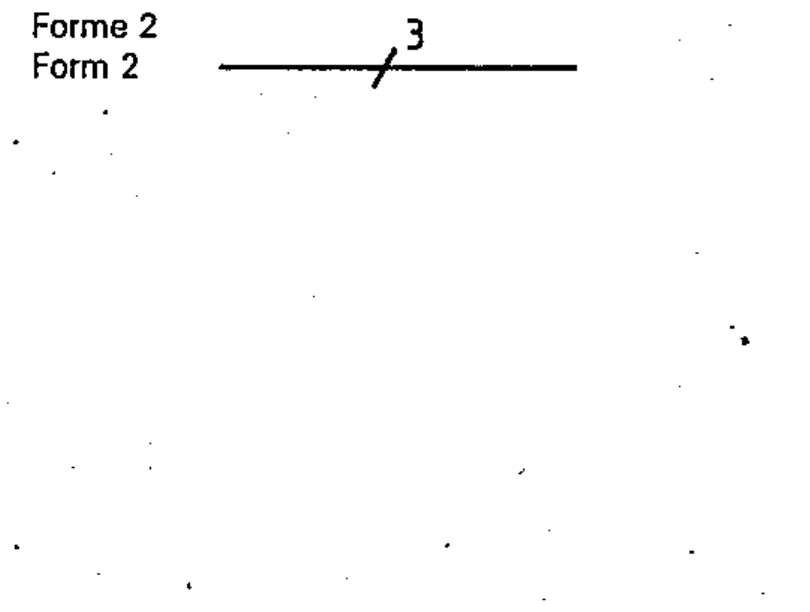

# 03-01-03 — Three conductors (Form 2)

Per-symbol crop from Publication No.617-3.pdf, printed p.4 ([full page](../assets/60617-3/p03.png)).

**Standard:** [[60617-3]] · **Section:** [[60617-3-1-conductors]] · **Form 2**

## Description
Three conductors, indicated by adding one oblique stroke completed by the figure 3.

## Names
- **EN:** Three conductors (Form 2)
- **FR:** Trois conducteurs (Forme 2)

## Notes
- Additional information may be indicated as follows. Above the line: kind of current, system of distribution, frequency and voltage. Below the line: the number of conductors of the circuit followed by a multiplication sign and the cross-sectional area of each conductor; if different sizes of conductors are used, their particulars are separated by a plus sign; the conductor material may be indicated by its chemical symbol.

## Related
- [[03-01-02]] — alternative form
- [[03-01-01]]
- uses [[single-line-representation]]
