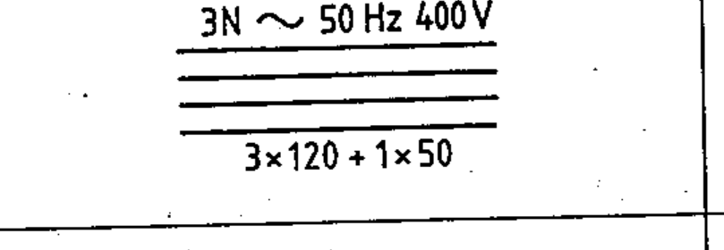

# 03-01-05 — Three-phase circuit — annotation example

Per-symbol crop from Publication No.617-3.pdf, printed p.5 ([full page](../assets/60617-3/p04.png)).

**Standard:** [[60617-3]] · **Section:** [[60617-3-1-conductors]]

## Description
Worked example of conductor annotation: a three-phase circuit, 50 Hz, 400 V, three conductors of 120 mm² with a neutral of 50 mm² (shown as “3N ∼ 50 Hz 400 V” above the line and “3 × 120 + 1 × 50” below it).

## Names
- **EN:** Three-phase circuit — annotation example
- **FR:** Circuit à courant triphasé, 50 Hz, 400 V, trois conducteurs de 120 mm², avec fil neutre de 50 mm²

## Related
- [[03-01-04]]
