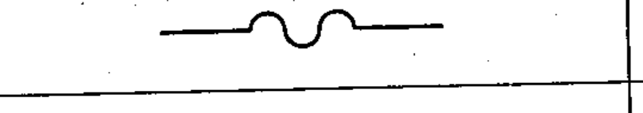

# 03-01-06 — Flexible conductor

Per-symbol crop from Publication No.617-3.pdf, printed p.5 ([full page](../assets/60617-3/p04.png)).

**Standard:** [[60617-3]] · **Section:** [[60617-3-1-conductors]]

## Description
A flexible conductor.

## Names
- **EN:** Flexible conductor
- **FR:** Conducteur flexible

