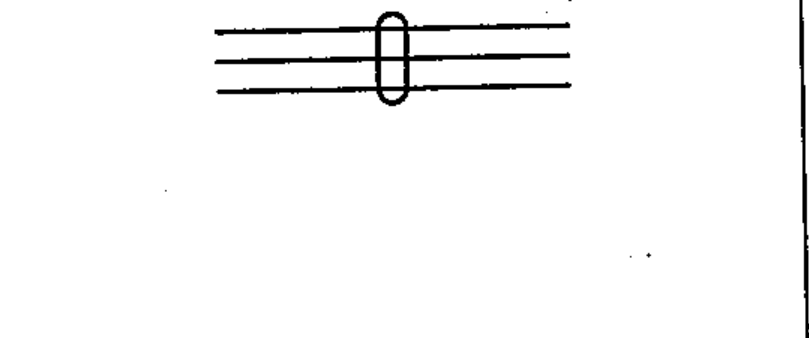

# 03-01-09 — Conductors in a cable

Per-symbol crop from Publication No.617-3.pdf, printed p.5 ([full page](../assets/60617-3/p04.png)).

**Standard:** [[60617-3]] · **Section:** [[60617-3-1-conductors]]

## Description
Conductors in a cable, three conductors shown.

## Names
- **EN:** Conductors in a cable
- **FR:** Conducteurs dans un câble

## Notes
- If several conductors are in a cable (or twisted together or in a screen) but the lines representing them on a diagram are not adjacent to each other, the method shown by symbol 03-01-10 may be used.

## Related
- [[03-01-10]]
- [[03-01-07]]
- [[03-01-08]]
