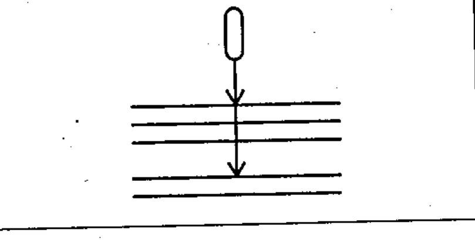

# 03-01-10 — Conductors in a cable, non-adjacent — example

Per-symbol crop from Publication No.617-3.pdf, printed p.5 ([full page](../assets/60617-3/p04.png)).

**Standard:** [[60617-3]] · **Section:** [[60617-3-1-conductors]]

## Description
Worked example: two conductors out of five in a cable, used when the lines representing the cabled conductors are not drawn adjacent to one another.

## Names
- **EN:** Conductors in a cable, non-adjacent — example
- **FR:** Exemple : deux conducteurs parmi cinq sont dans un câble

## Related
- [[03-01-09]]
