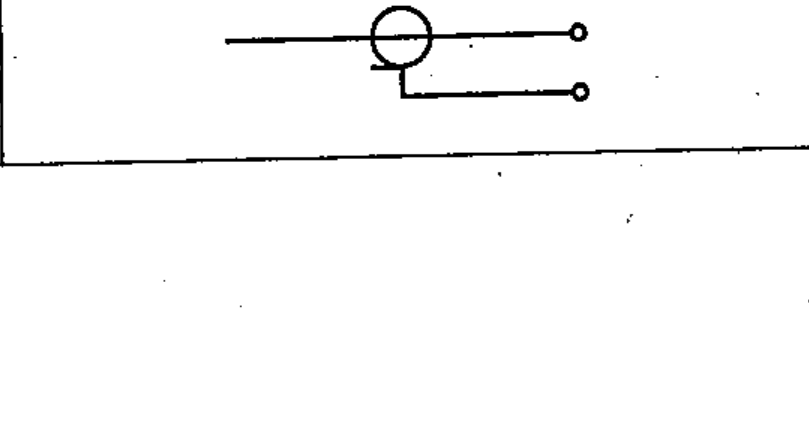

# 03-01-12 — Coaxial pair connected to terminals — example

Per-symbol crop from Publication No.617-3.pdf, printed p.5 ([full page](../assets/60617-3/p04.png)).

**Standard:** [[60617-3]] · **Section:** [[60617-3-1-conductors]]

## Description
Worked example: a coaxial pair connected to terminals.

## Names
- **EN:** Coaxial pair connected to terminals — example
- **FR:** Exemple : paire coaxiale raccordée sur bornes

## Related
- [[03-01-11]]
