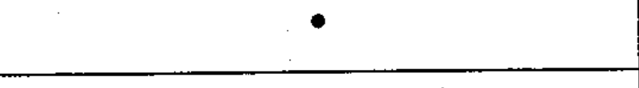

# 03-02-01 — Connection of conductors

Per-symbol crop from Publication No.617-3.pdf, printed p.7 ([full page](../assets/60617-3/p06.png)).

**Standard:** [[60617-3]] · **Section:** [[60617-3-2-terminals]]

## Description
Connection of conductors.

## Names
- **EN:** Connection of conductors
- **FR:** Connexion de conducteurs

