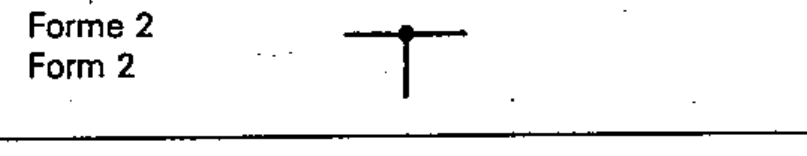

# 03-02-05 — Junction of conductors (Form 2)

Per-symbol crop from Publication No.617-3.pdf, printed p.7 ([full page](../assets/60617-3/p06.png)).

**Standard:** [[60617-3]] · **Section:** [[60617-3-2-terminals]] · **Form 2**

## Description
Junction of conductors.

## Names
- **EN:** Junction of conductors (Form 2)
- **FR:** Dérivation (Forme 2)

## Related
- [[03-02-04]] — alternative form
