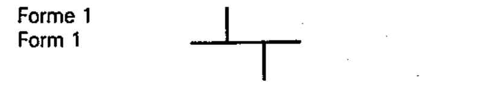

# 03-02-06 — Double junction of conductors (Form 1)

Per-symbol crop from Publication No.617-3.pdf, printed p.7 ([full page](../assets/60617-3/p06.png)).

**Standard:** [[60617-3]] · **Section:** [[60617-3-2-terminals]] · **Form 1**

## Description
Double junction of conductors.

## Names
- **EN:** Double junction of conductors (Form 1)
- **FR:** Double dérivation (Forme 1)

## Related
- [[03-02-07]] — alternative form
