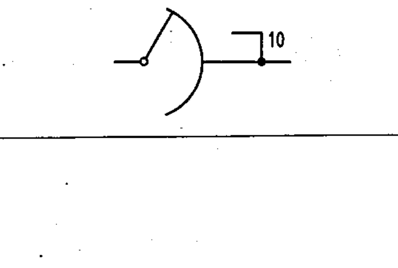

# 03-02-10 — Multipled uniselector hooks — example

Per-symbol crop from Publication No.617-3.pdf, printed p.7 ([full page](../assets/60617-3/p06.png)).

**Standard:** [[60617-3]] · **Section:** [[60617-3-2-terminals]]

## Description
Worked example: multipled uniselector hooks shown for 10 banks.

## Names
- **EN:** Multipled uniselector hooks — example
- **FR:** Exemple : bancs multiples figurés pour 10 bancs

## Related
- [[03-02-09]]
