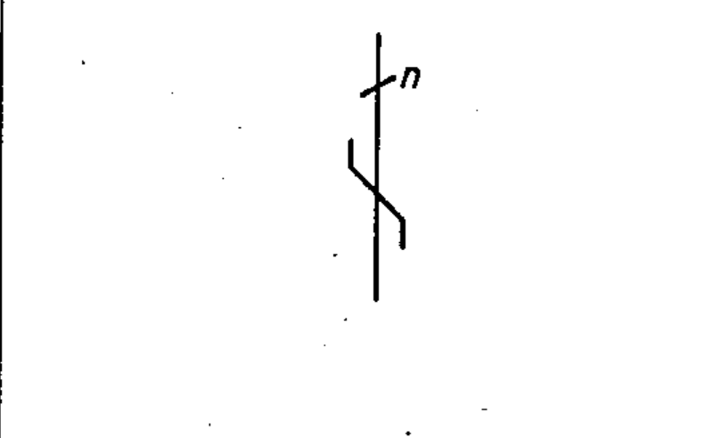

# 03-02-11 — Interchange of conductors / change of phase sequence / inversion of polarity

Per-symbol crop from Publication No.617-3.pdf, printed p.8 ([full page](../assets/60617-3/p07.png)).

**Standard:** [[60617-3]] · **Section:** [[60617-3-2-terminals]]

## Description
Interchange of conductors, change of phase sequence, or inversion of polarity, shown for n conductors in single-line representation.

## Names
- **EN:** Interchange of conductors / change of phase sequence / inversion of polarity
- **FR:** Permutation des conducteurs, changement de l'ordre de succession des phases ou inversion de polarité

## Notes
- The interchanged conductors may be indicated.
- For the identification of the conductors, IEC Publication 445 (Identification of apparatus terminals and general rules for a uniform system of terminal marking, using an alphanumeric notation) applies.

## Related
- [[03-02-12]]
- uses [[single-line-representation]]
- references **IEC 445**
