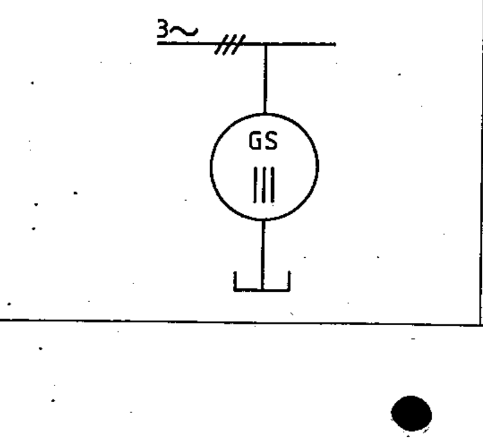

# 03-02-14 — Synchronous generator with external neutral point — example

Per-symbol crop from Publication No.617-3.pdf, printed p.8 ([full page](../assets/60617-3/p07.png)).

**Standard:** [[60617-3]] · **Section:** [[60617-3-2-terminals]]

## Description
Worked example: a three-phase synchronous generator with both leads of each phase brought out, shown with an external neutral point.

## Names
- **EN:** Synchronous generator with external neutral point — example
- **FR:** Exemple : alternateur triphasé, deux extrémités sorties sur chaque phase, point neutre extérieur

## Related
- [[03-02-13]]
