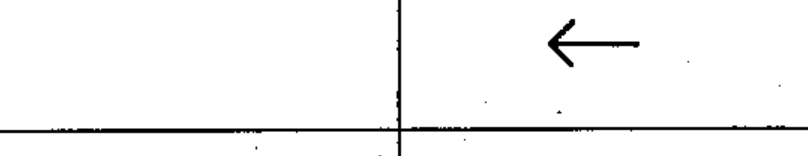

# 03-03-04 — Pole of a plug

Per-symbol crop from Publication No.617-3.pdf, printed p.9 ([full page](../assets/60617-3/p08.png)).

**Standard:** [[60617-3]] · **Section:** [[60617-3-3-connecting-devices]]

## Description
Pole of a plug. Other form.

## Names
- **EN:** Pole of a plug
- **FR:** Pôle d'une fiche

## Related
- [[03-03-03]]
