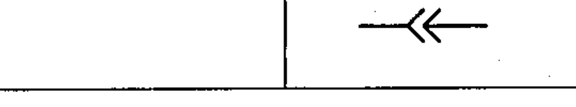

# 03-03-06 — Plug and socket (other form)

Per-symbol crop from Publication No.617-3.pdf, printed p.9 ([full page](../assets/60617-3/p08.png)).

**Standard:** [[60617-3]] · **Section:** [[60617-3-3-connecting-devices]]

## Description
A plug and socket (male and female). Other form.

## Names
- **EN:** Plug and socket (other form)
- **FR:** Fiche et prise (autre forme)

## Related
- [[03-03-05]] — alternative form
