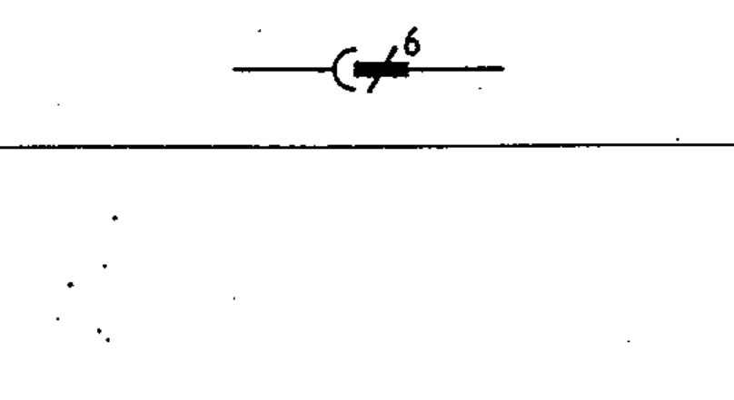

# 03-03-08 — Multipole plug and socket — single-line

Per-symbol crop from Publication No.617-3.pdf, printed p.9 ([full page](../assets/60617-3/p08.png)).

**Standard:** [[60617-3]] · **Section:** [[60617-3-3-connecting-devices]]

## Description
Multipole plug and socket, shown with six poles, in single-line representation.

## Names
- **EN:** Multipole plug and socket — single-line
- **FR:** Fiche et prise multipolaires : représentation unifilaire

## Related
- [[03-03-07]] — alternative form
- uses [[single-line-representation]]
