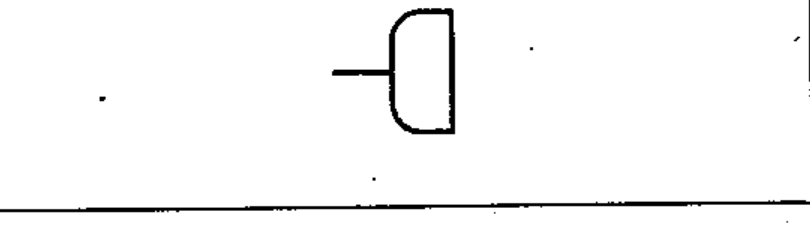

# 03-03-10 — Connector assembly, movable portion

Per-symbol crop from Publication No.617-3.pdf, printed p.10 ([full page](../assets/60617-3/p09.png)).

**Standard:** [[60617-3]] · **Section:** [[60617-3-3-connecting-devices]]

## Description
Connector assembly, movable portion.

## Names
- **EN:** Connector assembly, movable portion
- **FR:** Ensemble de connecteurs, partie mobile

## Notes
- The note with symbol 03-03-09 applies.

## Related
- [[03-03-09]]
