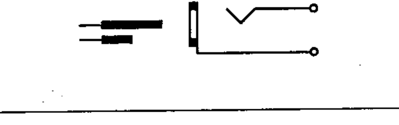

# 03-03-12 — Plug and jack, telephone type, two-pole

Per-symbol crop from Publication No.617-3.pdf, printed p.10 ([full page](../assets/60617-3/p09.png)).

**Standard:** [[60617-3]] · **Section:** [[60617-3-3-connecting-devices]]

## Description
Plug and jack, telephone type, two-pole.

## Names
- **EN:** Plug and jack, telephone type, two-pole
- **FR:** Fiche et jack, bipolaires, type téléphone

## Notes
- The longest pole on the plug symbol represents the tip of the plug, and the shortest the sleeve.

## Related
- [[03-03-13]]
