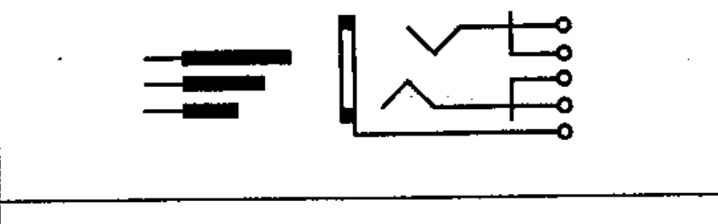

# 03-03-13 — Plug and jack, telephone type, three-pole

Per-symbol crop from Publication No.617-3.pdf, printed p.10 ([full page](../assets/60617-3/p09.png)).

**Standard:** [[60617-3]] · **Section:** [[60617-3-3-connecting-devices]]

## Description
Plug and jack, telephone type, three-pole, the jack shown with breaking contacts.

## Names
- **EN:** Plug and jack, telephone type, three-pole
- **FR:** Fiche et jack, tripolaires, type téléphone, jack figuré avec contacts de rupture

## Notes
- The note with symbol 03-03-12 applies.

## Related
- [[03-03-12]]
- [[03-03-14]]
