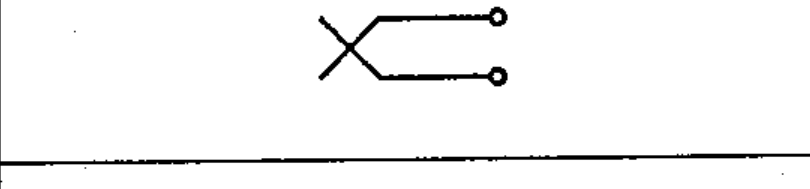

# 03-03-14 — Break or isolating jack, telephone type

Per-symbol crop from Publication No.617-3.pdf, printed p.10 ([full page](../assets/60617-3/p09.png)).

**Standard:** [[60617-3]] · **Section:** [[60617-3-3-connecting-devices]]

## Description
Break or isolating jack, telephone type.

## Names
- **EN:** Break or isolating jack, telephone type
- **FR:** Jack de coupure ou de séparation, type téléphone

## Related
- [[03-03-13]]
