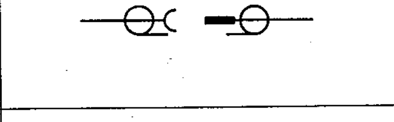

# 03-03-15 — Coaxial plug and socket

Per-symbol crop from Publication No.617-3.pdf, printed p.10 ([full page](../assets/60617-3/p09.png)).

**Standard:** [[60617-3]] · **Section:** [[60617-3-3-connecting-devices]]

## Description
Coaxial plug and socket.

## Names
- **EN:** Coaxial plug and socket
- **FR:** Fiche coaxiale et prise coaxiale

## Notes
- If the coaxial plug or socket is connected to a coaxial pair, the tangential line(s) should be appropriately extended.

## Related
- [[03-01-11]]
