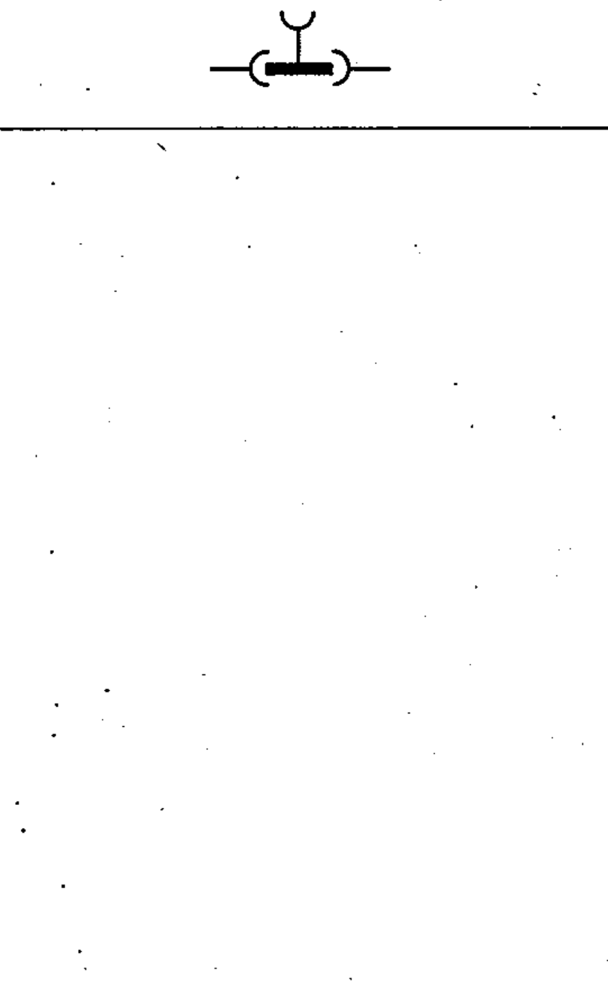

# 03-03-22 — Plug-and-socket connector: male-male with socket access

Per-symbol crop from Publication No.617-3.pdf, printed p.11 ([full page](../assets/60617-3/p10.png)).

**Standard:** [[60617-3]] · **Section:** [[60617-3-3-connecting-devices]]

## Description
Plug-and-socket-type connector: male-male with socket access.

## Names
- **EN:** Plug-and-socket connector: male-male with socket access
- **FR:** Fiche et prise de connecteur : mâle-mâle avec prise de dérivation

## Related
- [[03-03-20]]
