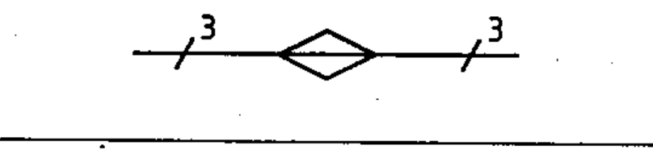

# 03-04-04 — Straight-through joint box — single-line

Per-symbol crop from Publication No.617-3.pdf, printed p.12 ([full page](../assets/60617-3/p11.png)).

**Standard:** [[60617-3]] · **Section:** [[60617-3-4-cable-fittings]]

## Description
Straight-through joint box, in single-line representation.

## Names
- **EN:** Straight-through joint box — single-line
- **FR:** Boîte de jonction : représentation unifilaire

## Related
- [[03-04-03]] — alternative form
- uses [[single-line-representation]]
