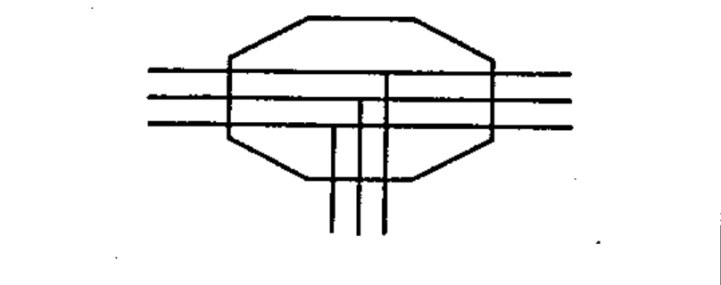

# 03-04-05 — Junction box with T-connection — multi-line

Per-symbol crop from Publication No.617-3.pdf, printed p.12 ([full page](../assets/60617-3/p11.png)).

**Standard:** [[60617-3]] · **Section:** [[60617-3-4-cable-fittings]]

## Description
Junction box, shown with three conductors with a T-connection, in multi-line representation.

## Names
- **EN:** Junction box with T-connection — multi-line
- **FR:** Boîte pour une dérivation, figurée avec trois conducteurs avec dérivation : représentation multifilaire

## Related
- [[03-04-06]] — alternative form
- uses [[multi-line-representation]]
