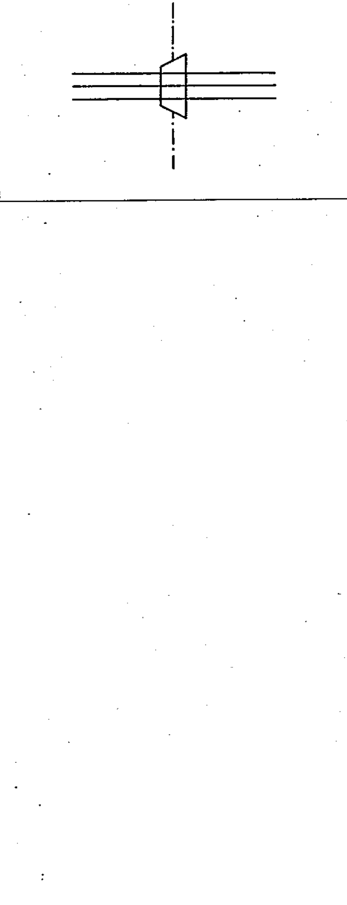

# 03-04-07 — Pressure-tight bulkhead cable gland

Per-symbol crop from Publication No.617-3.pdf, printed p.13 ([full page](../assets/60617-3/p12.png)).

**Standard:** [[60617-3]] · **Section:** [[60617-3-4-cable-fittings]]

## Description
Pressure-tight bulkhead cable gland, shown with three cables.

## Names
- **EN:** Pressure-tight bulkhead cable gland
- **FR:** Dispositif étanche de passage de câbles, figuré avec trois câbles

## Notes
- The high-pressure side is the longer side of the trapezoid, thus retaining the gland in the bulkhead.

