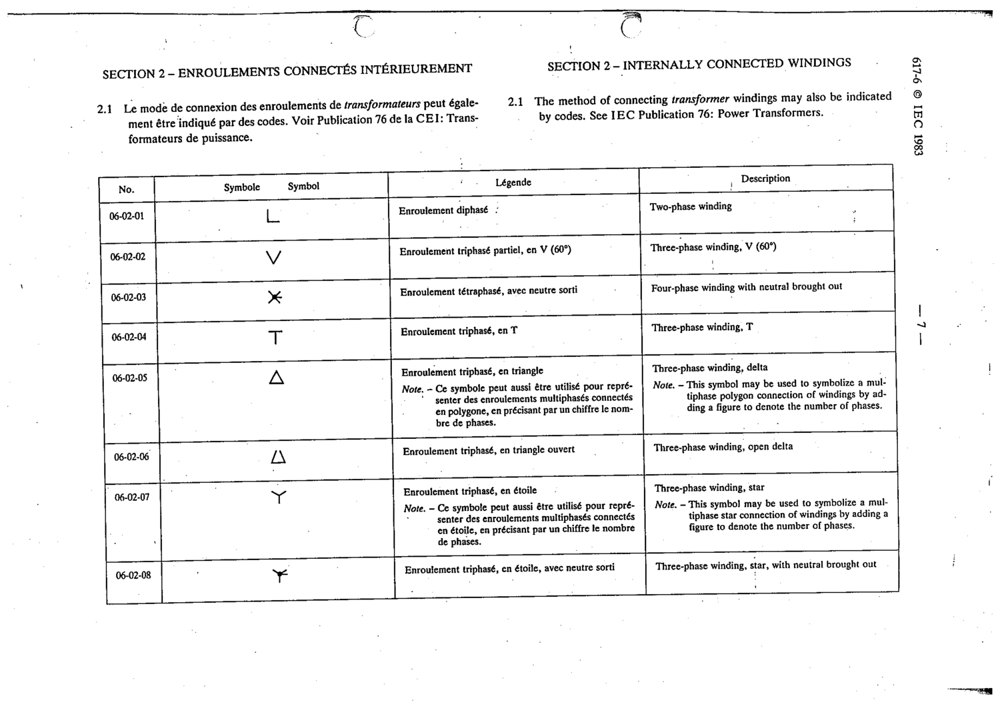

# 06-02-08 — Three-phase winding, star with neutral brought out

This symbol appears on Publication No.617-6.pdf, printed p.7 (full page shown).

**Standard:** [[60617-6]] · **Section:** [[60617-6-02-internally-connected-windings]]

## Description
Three-phase winding, star with neutral brought out

## Names
- **EN:** Three-phase winding, star with neutral brought out
- **FR:** Enroulement triphasé, en étoile, avec neutre sorti

