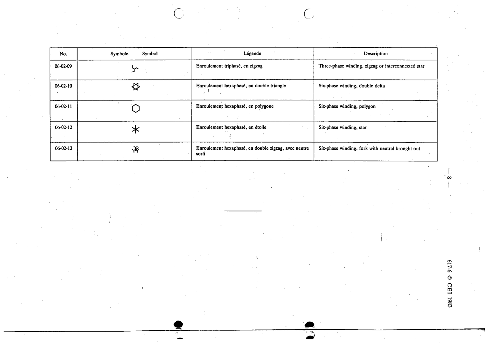

# 06-02-10 — Six-phase winding, double delta

This symbol appears on Publication No.617-6.pdf, printed p.8 (full page shown).

**Standard:** [[60617-6]] · **Section:** [[60617-6-02-internally-connected-windings]]

## Description
Six-phase winding, double delta

## Names
- **EN:** Six-phase winding, double delta
- **FR:** Enroulement hexaphasé, en double triangle

