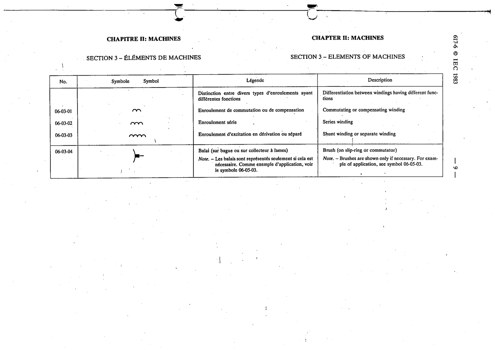

# 06-03-04 — Brush (on slip-ring or commutator)

This symbol appears on Publication No.617-6.pdf, printed p.9 (full page shown).

**Standard:** [[60617-6]] · **Section:** [[60617-6-03-elements-of-machines]]

## Description
Brush (on slip-ring or commutator)

## Names
- **EN:** Brush (on slip-ring or commutator)
- **FR:** Balai (sur bague ou sur collecteur à lames)

## Notes
- Brushes are shown only if necessary. For example of application, see symbol 06-05-03.

## Related
- [[06-05-03]]
