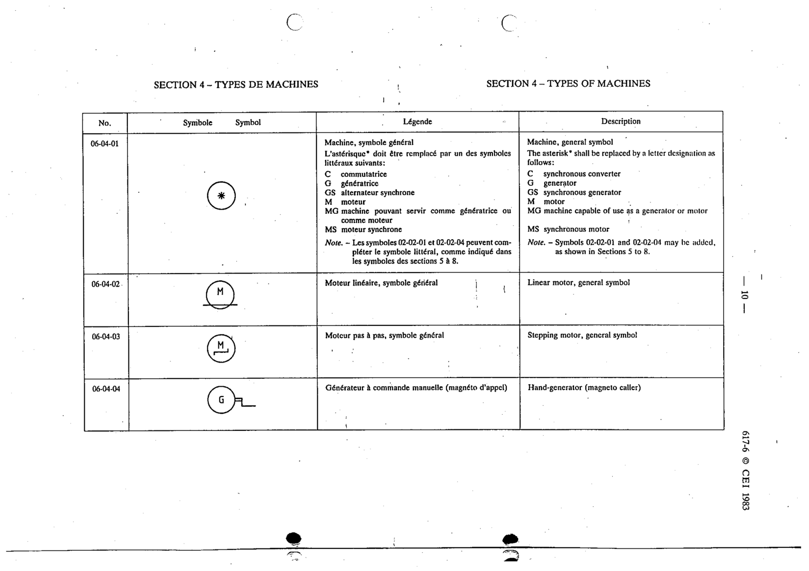

# 06-04-01 — Machine, general symbol

This symbol appears on Publication No.617-6.pdf, printed p.10 (full page shown).

**Standard:** [[60617-6]] · **Section:** [[60617-6-04-types-of-machines]]

## Description
The asterisk shall be replaced by a letter designation: C synchronous converter, G generator, GS synchronous generator, M motor, MG machine usable as generator or motor, MS synchronous motor.

## Names
- **EN:** Machine, general symbol
- **FR:** Machine, symbole général

## Notes
- Symbols 02-02-01 and 02-02-04 may be added, as shown in Sections 5 to 8.

## Related
- [[02-02-01]]
- [[02-02-04]]
