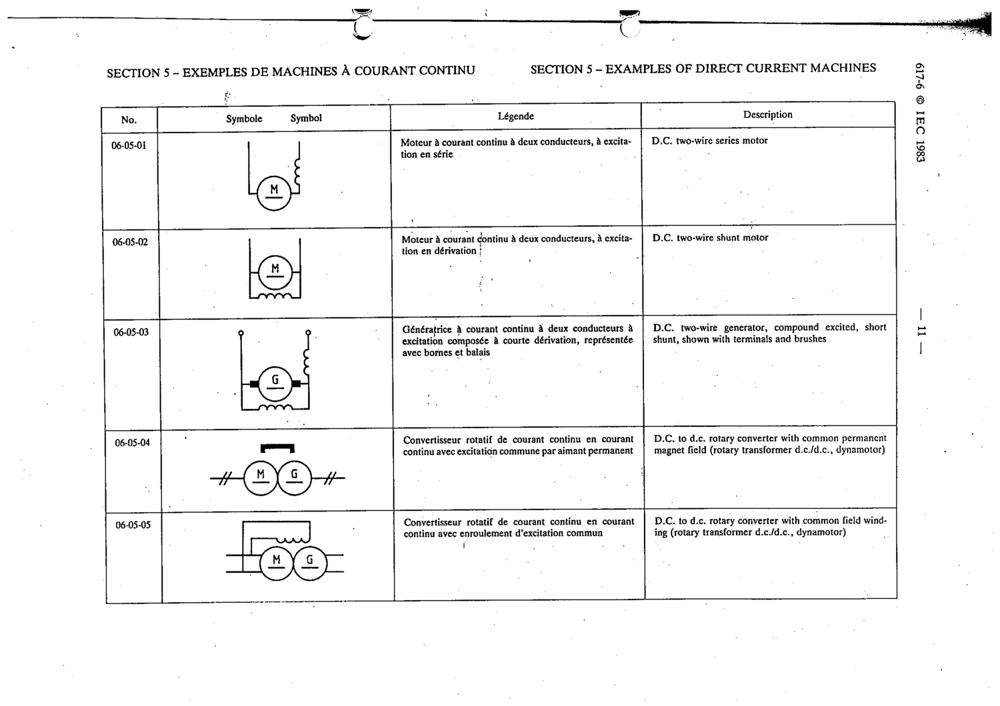

# 06-05-05 — D.C.-to-d.c. rotary converter with common field winding (dynamotor)

This symbol appears on Publication No.617-6.pdf, printed p.11 (full page shown).

**Standard:** [[60617-6]] · **Section:** [[60617-6-05-examples-of-direct-current]]

## Description
D.C.-to-d.c. rotary converter with common field winding (dynamotor)

## Names
- **EN:** D.C.-to-d.c. rotary converter with common field winding (dynamotor)
- **FR:** Convertisseur rotatif CC-CC avec enroulement d'excitation commun

