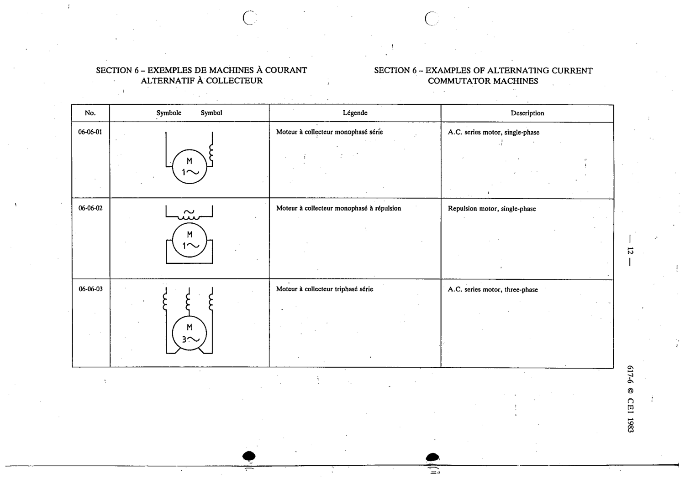

# 06-06-03 — A.C. series motor, three-phase

This symbol appears on Publication No.617-6.pdf, printed p.12 (full page shown).

**Standard:** [[60617-6]] · **Section:** [[60617-6-06-examples-of-alternating-current]]

## Description
A.C. series motor, three-phase

## Names
- **EN:** A.C. series motor, three-phase
- **FR:** Moteur à collecteur triphasé série

