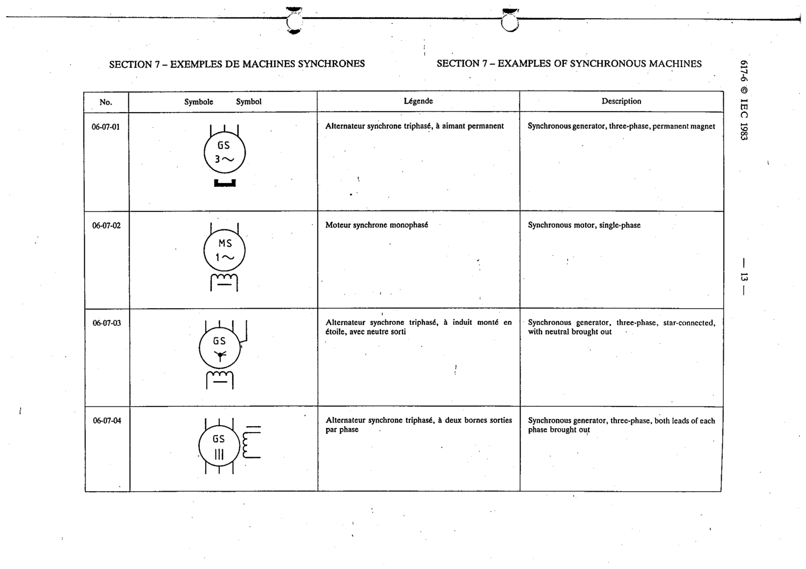

# 06-07-04 — Synchronous generator, three-phase, both leads of each phase brought out

This symbol appears on Publication No.617-6.pdf, printed p.13 (full page shown).

**Standard:** [[60617-6]] · **Section:** [[60617-6-07-examples-of-synchronous-machines]]

## Description
Synchronous generator, three-phase, both leads of each phase brought out

## Names
- **EN:** Synchronous generator, three-phase, both leads of each phase brought out
- **FR:** Alternateur synchrone triphasé, à deux bornes sorties par phase

