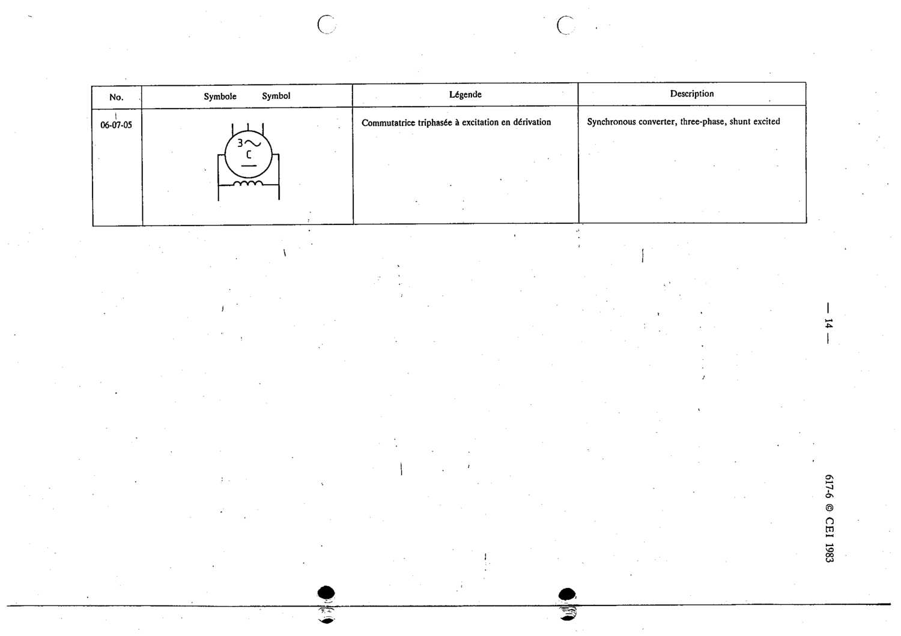

# 06-07-05 — Synchronous converter, three-phase, shunt excited

This symbol appears on Publication No.617-6.pdf, printed p.14 (full page shown).

**Standard:** [[60617-6]] · **Section:** [[60617-6-07-examples-of-synchronous-machines]]

## Description
Synchronous converter, three-phase, shunt excited

## Names
- **EN:** Synchronous converter, three-phase, shunt excited
- **FR:** Commutatrice triphasée à excitation en dérivation

