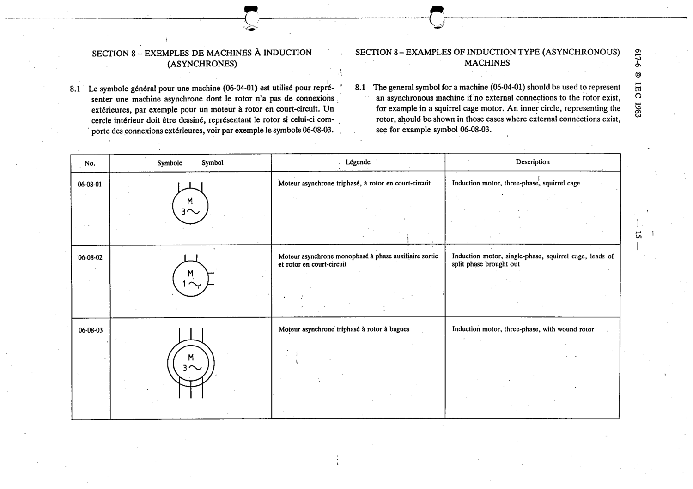

# 06-08-03 — Induction motor, three-phase, with wound rotor

This symbol appears on Publication No.617-6.pdf, printed p.15 (full page shown).

**Standard:** [[60617-6]] · **Section:** [[60617-6-08-examples-of-induction-asynchronous]]

## Description
Induction motor, three-phase, with wound rotor

## Names
- **EN:** Induction motor, three-phase, with wound rotor
- **FR:** Moteur asynchrone triphasé à rotor à bagues

