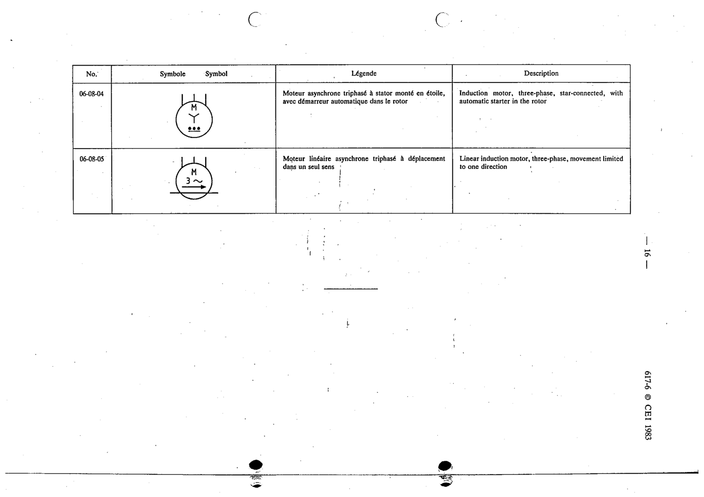

# 06-08-05 — Linear induction motor, three-phase, movement limited to one direction

This symbol appears on Publication No.617-6.pdf, printed p.16 (full page shown).

**Standard:** [[60617-6]] · **Section:** [[60617-6-08-examples-of-induction-asynchronous]]

## Description
Linear induction motor, three-phase, movement limited to one direction

## Names
- **EN:** Linear induction motor, three-phase, movement limited to one direction
- **FR:** Moteur linéaire asynchrone triphasé à déplacement dans un seul sens

