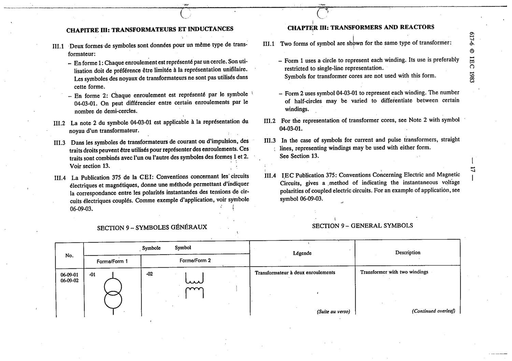

# 06-09-01 — Transformer with two windings

This symbol appears on Publication No.617-6.pdf, printed p.17 (full page shown).

**Standard:** [[60617-6]] · **Section:** [[60617-6-09-general-symbols-transformers-and]] · **Form 1**

## Description
Transformer with two windings.

## Names
- **EN:** Transformer with two windings
- **FR:** Transformateur à deux enroulements

## Related
- [[04-03-01]]
