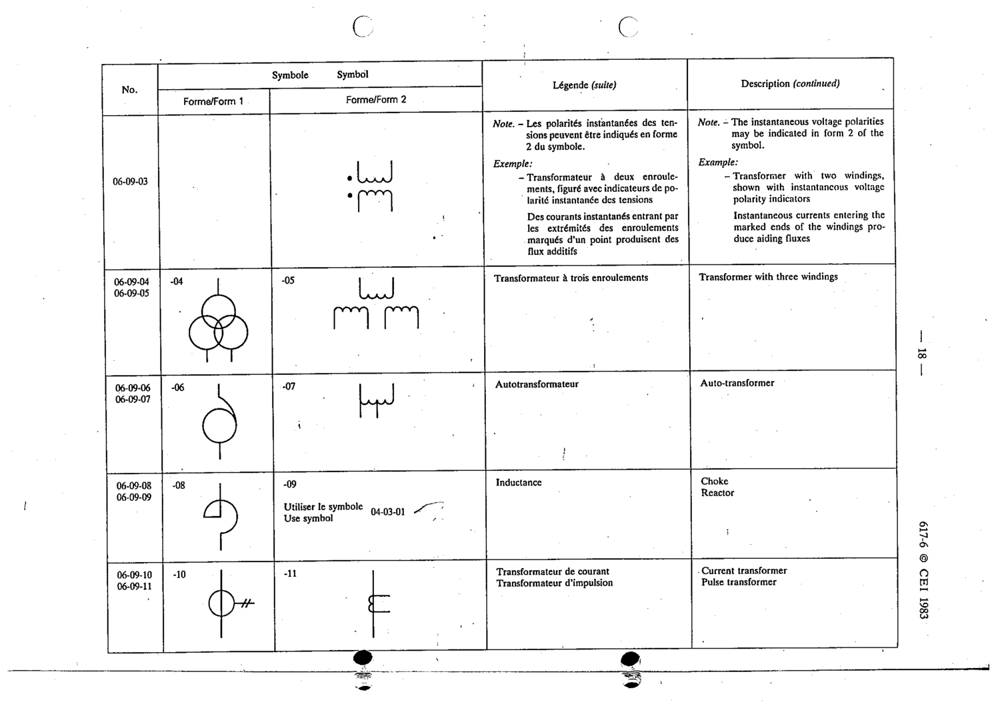

# 06-09-10 — Current transformer / pulse transformer

This symbol appears on Publication No.617-6.pdf, printed p.18 (full page shown).

**Standard:** [[60617-6]] · **Section:** [[60617-6-09-general-symbols-transformers-and]] · **Form 1**

## Description
Current transformer / pulse transformer.

## Names
- **EN:** Current transformer / pulse transformer
- **FR:** Transformateur de courant / transformateur d'impulsion

