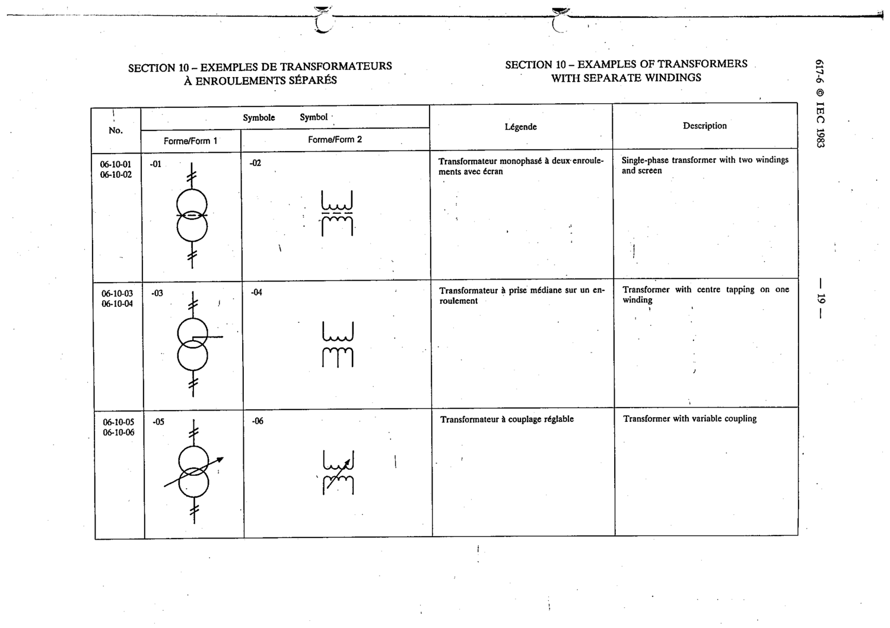

# 06-10-03 — Transformer with centre tapping on one winding

This symbol appears on Publication No.617-6.pdf, printed p.19 (full page shown).

**Standard:** [[60617-6]] · **Section:** [[60617-6-10-examples-of-transformers-with]] · **Form 1**

## Description
Transformer with centre tapping on one winding

## Names
- **EN:** Transformer with centre tapping on one winding
- **FR:** Transformateur à prise médiane sur un enroulement

