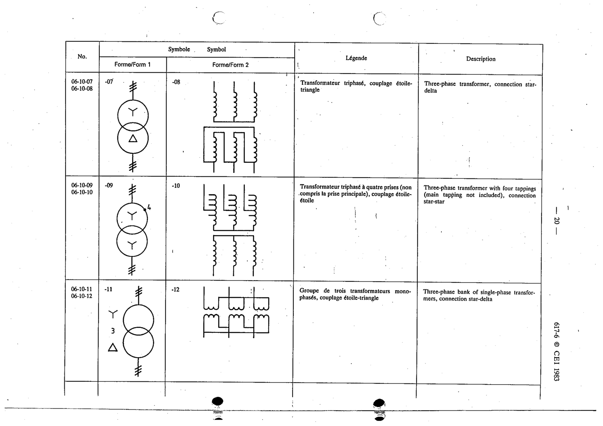

# 06-10-10 — Three-phase transformer with four tappings, connection star-star

This symbol appears on Publication No.617-6.pdf, printed p.20 (full page shown).

**Standard:** [[60617-6]] · **Section:** [[60617-6-10-examples-of-transformers-with]] · **Form 2**

## Description
Three-phase transformer with four tappings, connection star-star

## Names
- **EN:** Three-phase transformer with four tappings, connection star-star
- **FR:** Transformateur triphasé à quatre prises, couplage étoile-étoile

